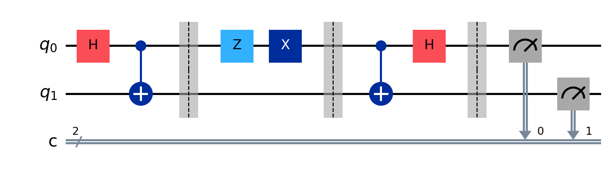
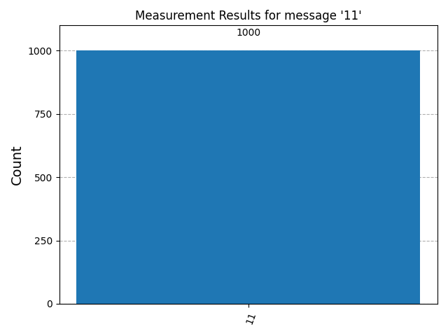

# Superdense Coding Protocol

A pure implementation of the **Superdense Coding Protocol** using **IBM Qiskit**. This project demonstrates a fundamental quantum advantage: the ability to transmit **two classical bits** of information by sending only **one physical qubit**.


##  Overview

In classical communications, sending 2 bits (e.g., "11") requires transmitting 2 physical bits through a wire.
**Superdense Coding** uses quantum entanglement to double this capacity. By manipulating half of an entangled pair, Alice can encode 2 bits of logic into the joint state and send her single qubit to Bob, who decodes the full message.

**It is the exact inverse of Quantum Teleportation:**
* **Teleportation:** Consumes 2 classical bits to send 1 Qubit.
* **Superdense Coding:** Consumes 1 Qubit to send 2 classical bits.

##  Theoretical Background

The protocol relies on the 4 orthogonal **Bell States**.
We start with a shared entangled pair in the state $|\Phi^+\rangle = \frac{|00\rangle + |11\rangle}{\sqrt{2}}$.

Alice can transform this global state into any of the 3 other Bell states by applying a local gate only on her qubit ($q_0$):

| Classical Message | Alice's Gate ($q_0$) | Resulting Bell State | Quantum State Expression |
| :---: | :---: | :---: | :---: |
| **00** | Identity ($I$) | $\vert \Phi^+\rangle$ | $\frac{\vert 00\rangle + \vert 11\rangle}{\sqrt{2}}$ |
| **10** | Bit-Flip ($X$) | $\vert \Psi^+\rangle$ | $\frac{\vert 01\rangle + \vert 10\rangle}{\sqrt{2}}$ |
| **01** | Phase-Flip ($Z$) | $\vert \Phi^-\rangle$ | $\frac{\vert 00\rangle - \vert 11\rangle}{\sqrt{2}}$ |
| **11** | Both ($Z \cdot X$) | $\vert \Psi^-\rangle$ | $\frac{\vert 01\rangle - \vert 10\rangle}{\sqrt{2}}$ |

Bob then performs a Bell Measurement (CNOT + Hadamard) to distinguish which of these 4 states the system is in, effectively recovering the two bits.

##  The Circuit (Step-by-Step)

The following circuit demonstrates the transmission of the message **"11"** (the most complex case requiring both X and Z gates).



### 1. Entanglement (Preparation)
A Bell pair is created using $H$ and $CNOT$. Alice takes $q_0$, Bob takes $q_1$.

### 2. Encoding (Alice)
To send "11", Alice applies a **Z-gate** followed by an **X-gate** to her qubit $q_0$.
*Note: In the diagram, the Z gate (light blue) and X gate (dark blue) represent this encoding.*

### 3. Transmission
Alice sends $q_0$ to Bob. (Represented by the barrier).

### 4. Decoding (Bob)
Bob now possesses both qubits. He applies the inverse of the entanglement process:
1.  **CNOT** ($q_0 \to q_1$)
2.  **Hadamard** ($q_0$)

### 5. Measurement
Bob measures both qubits. The result collapses to the classical bits **11**.

## Results & Verification

The script automatically tests all 4 possible messages (00, 01, 10, 11) with 1000 shots each.

**Statistical Results Example for "11":**

The histogram below confirms that for the specific case of sending "11", Bob measures the state "11" with **~100% probability**. This proves the deterministic nature of the protocol despite the use of quantum probabilities.



## Installation & Usage

**Prerequisites:**
- Python 3.10+
- Qiskit 1.0+

**Setup**
```bash
# Clone the repository
git clone https://github.com/Hyma3/superdense-coding.git
cd superdense-coding

# Create virtual env
python3 -m venv .venv
source .venv/bin/activate

# Install dependencies
pip install qiskit qiskit-aer matplotlib pylatexenc
```

**Run the Protocol**
```bash
python superdense_coding.py
```
**Author**
Numa Guiot
* LinkedIn: [numaguiot](https://www.linkedin.com/in/numaguiot/)
* Built with IBM Qiskit

## License
Academic Project - Open Source (MIT License)